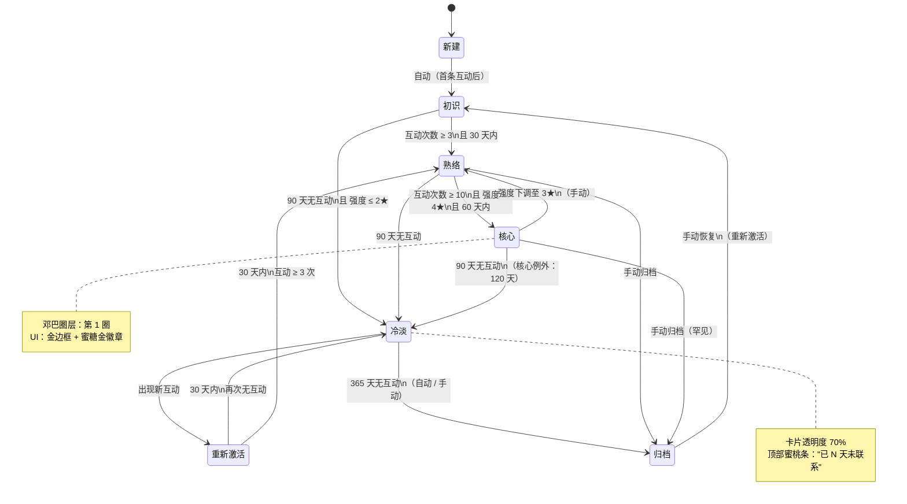

# 「人际关系 · 情报中心」架构方案 v3.0

> v2.0 基础上的**章节深化专版**
>
> 本版专攻三个深化模块 + 两个新增模块：
> 1. **🆕 邓巴圈层模型** —— 把关系分层从"强度一维"升级到"圈层四维"
> 2. **🆕 人物属性 v3.0** —— 字段完整重构（含信任度 / 情感倾向 / 扩展位）
> 3. **🔍 状态机完整流程图** —— 所有触发条件、转移路径、异常分支
> 4. **🔍 AI 增强点逐个规格** —— 7 个功能，每个都有输入/输出/算法/时机/效果
> 5. **🔍 自动化规则编辑器 UI** —— 画布 / 触发器 / 动作 / 拖拽 / 预览完整设计

---

## 第 1 章 · 邓巴圈层模型（Dunbar's Tiers）

### 1.1 圈层定义

> 罗宾·邓巴（Robin Dunbar）提出：人类稳定社交网络约 150 人，分为多层嵌套的同心圆。
> 本系统采用经典的"5 / 15 / 50 / 150"四圈层结构。

| 圈层 | 名称 | 容量 | 典型关系 | 互动频率 |
|---|---|---|---|---|
| **第 1 圈** | 核心支持层 | **≤ 5 人** | 伴侣、至亲、铁哥们 | 每周多次，几乎随时可联系 |
| **第 2 圈** | 亲密朋友圈 | **≤ 15 人** | 挚友、导师、重要同事 | 每月数次 |
| **第 3 圈** | 一般朋友圈 | **≤ 50 人** | 普通朋友、同学、同事 | 每季度一两次 |
| **第 4 圈** | 熟人与弱连接 | **≤ 150 人** | 点头之交、远距离朋友 | 半年一次以上 |
| 圈外 | 档案层 | 无上限 | 仅留过联系方式的人 | 几乎无互动 |

### 1.2 数据字段

```javascript
contact.dunbarTier = {
  tier: 1 | 2 | 3 | 4 | null,   // 当前圈层
  manual: true | false,          // 是否手动指定
  inferredAt: ISO,                // 上次推断时间
  inferredReason: string,         // 推断依据（自然语言）
  tierHistory: [{ tier, from, to, reason }]  // 圈层变更史
}
```

### 1.3 圈层与现有强度的映射

| 圈层 | 强度范围 | 容量预警 |
|---|---|---|
| 第 1 圈 | 5★ | > 5 人时建议审视 |
| 第 2 圈 | 4★ | > 15 人时建议审视 |
| 第 3 圈 | 2–3★ | > 50 人时建议审视 |
| 第 4 圈 | 1★ | > 150 人时建议审视 |

> **圈层 ≠ 强度的替代**，而是**互补**：强度衡量"亲密度"，圈层衡量"位置与责任"。

### 1.4 圈层动态平衡规则

**升级路径**（向内圈移动）
- 自动触发：连续 30 天互动频率 + 话题深度达到上圈标准
- 手动触发：用户主动调整
- 升级提示：彩色 toast "🎉 你和 XX 越来越近了，要不要把它升级到核心圈？"

**降级路径**（向外圈移动）
- 自动触发：连续 90 天无互动 + 当前圈层 ≠ 圈 1
- 手动触发：用户主动调整
- 降级提示：柔和提示 "📉 你和 XX 已经 N 天没联系了，要不要降级到边缘圈？"

**容量预警**
- 当某圈层人数超过容量上限 → 看板顶部蜜桃色横幅提示
- 提示内容："你的第 1 圈已有 6 人，超过邓巴建议 5 人。考虑审视哪些人可以移到第 2 圈。"

### 1.5 圈层在 UI 中的表现

**通讯录卡片**
```
┌──────────────────────────┐
│ 核心圈（紫底色 + 金边框） │
│ ┌──┐ 张三 ★★★★★  同事    │
│ │👤│ "上周一起跑步..."     │
│ └──┘                       │
├──────────────────────────┤
│ 中间圈（标准卡片）         │
│ ┌──┐ 李四 ★★★★   同学     │
│ │👤│ "上个月聊过..."       │
│ └──┘                       │
└──────────────────────────┘
```

**关系图谱**
- 圈层以同心圆形式呈现：
  - 内圈半径小，圆心是"我"
  - 每圈一层半透明彩色填充（紫 → 蓝 → 绿 → 灰）
  - 节点按圈层定位（不靠力导向）：圈 1 内圈，圈 2 第二圈……
  - 可点击圈层隐藏/显示

**看板**
- "邓巴分布"小卡片：4 个甜甜圈状统计，分别显示每圈人数 + 容量

---

## 第 2 章 · 人物属性 v3.0

### 2.1 完整字段表

**A. 基础信息**（必填）
| 字段 | 类型 | 说明 |
|---|---|---|
| `id` | uuid | 主键 |
| `name` | string | 主姓名 |
| `nickname` | string | 昵称 / 称呼 |
| `avatar` | object | `{ type: 'initials' \| 'emoji' \| 'color', value }` |
| `gender` | enum | 男 / 女 / 其他 / 不填 |
| `birthYear` | number | 出生年（用于自动算年龄） |
| `ageRange` | enum | 18-25 / 26-35 / 36-45 / 46-55 / 55+ |

**B. 联系方式**
| 字段 | 类型 | 说明 |
|---|---|---|
| `phone` | string | 手机 |
| `wechat` | object | `{ nick, id }` |
| `email` | string | 工作邮箱优先 |
| `address` | string | 现居地 |

**C. 关系信息**
| 字段 | 类型 | 说明 |
|---|---|---|
| `relationType` | enum | 亲属 / 伴侣 / 挚友 / 朋友 / 同事 / 同学 / 客户 / 师生 / 邻居 / 兴趣社群 / 其他 |
| `relationLabel` | string | 自定义标签（如"小学同桌"） |
| `metAt` | ISO | 初次见面时间 |
| `metScene` | string | 初次见面场景（"2019 年跑团活动"） |
| `introducedBy` | id | 引荐人 ID（可串联成图谱） |

**D. 圈层归属**（详见第 1 章）
| 字段 | 类型 |
|---|---|
| `dunbarTier` | object |

**E. 强度与互动**
| 字段 | 类型 | 说明 |
|---|---|---|
| `strength` | number | 手动 1-5 |
| `strengthAuto` | number | 自动计算建议值 |
| `interactionCount` | number | 累计互动次数 |
| `lastInteractionAt` | ISO | 最近互动时间 |
| `avgIntervalDays` | number | 平均互动间隔 |

**F. 情感与信任**
| 字段 | 类型 | 说明 |
|---|---|---|
| `trustLevel` | number | 信任度 1-5 |
| `emotionalTendency` | enum | 依赖型 / 独立型 / 竞争型 / 合作型 / 回避型 / 不明 |
| `sensitivityTopics` | string[] | 敏感话题（不导出 / 不送 LLM） |
| `emotionalNotes` | string | "他最近情绪低落，注意关心" |

**G. 标签 & 分类**
| 字段 | 类型 |
|---|---|
| `tags` | string[]（多维） |
| `customAttrs` | `[{ key, value, type: 'text' \| 'date' \| 'number' }]` |

**H. 备注**
| 字段 | 类型 |
|---|---|
| `notes` | string（Markdown） |
| `notesUpdatedAt` | ISO |

**I. 扩展位（用户自定义）**
| 字段 | 类型 |
|---|---|
| `schemaExtras` | `{ [fieldName]: any }` |

**J. 元数据**
| 字段 | 类型 |
|---|---|
| `createdAt` | ISO |
| `updatedAt` | ISO |
| `archived` | boolean |
| `archivedAt` | ISO \| null |
| `schemaVersion` | '3.0' |

### 2.2 自定义扩展位示例

```javascript
schemaExtras: {
  bloodType: 'A',
  companySize: '100-500',
  investmentPreference: '半导体',
  runsMarathon: true,
  marathonPB: '3:15:00'
}
```

> **设计原则**：基础字段覆盖 90% 场景；扩展位让用户任意补全；扩展位也参与搜索。

---

## 第 3 章 · 状态机完整流程图

### 3.1 主状态图（Mermaid 描述）



### 3.2 完整转移条件表

| From | To | 自动触发条件 | 手动触发 | UI 提示 |
|---|---|---|---|---|
| 新建 | 初识 | 首条互动后 | — | 默认状态 |
| 初识 | 熟络 | 互动 ≥ 3 次 + 30 天内 | ✓ | 🎉 升级蜜桃 toast |
| 初识 | 冷淡 | 90 天无互动 + 强度 ≤ 2★ | ✓ | 📉 柔和提示 |
| 熟络 | 核心 | 互动 ≥ 10 + 强度 ≥ 4★ + 60 天内 | ✓ | 🌟 金色 toast + 徽章 |
| 熟络 | 冷淡 | 90 天无互动 | ✓ | 📉 |
| 核心 | 熟络 | — | ✓ | 仅手动 |
| 核心 | 冷淡 | 120 天无互动（例外延长） | ✓ | 📉 |
| 冷淡 | 重新激活 | 任何新互动 | ✓ | 💫 闪烁高亮 |
| 重新激活 | 冷淡 | 30 天内再次无互动 | ✓ | 📉 |
| 重新激活 | 熟络 | 30 天内互动 ≥ 3 次 | ✓ | 🎉 |
| 任何 | 归档 | 365 天无互动 / 手动 | ✓ | 🗄️ 进入归档分组 |
| 归档 | 初识 | 手动恢复 | ✓ | ♻️ 恢复提示 |

### 3.3 异常分支处理

| 异常 | 处理 |
|---|---|
| **数据冲突**：自动推断和手动设置冲突 | 以手动为准 + 提示"系统推断 X 圈，你设置了 Y 圈，是否保留？" |
| **历史数据缺失**：从 v1 迁移过来的联系人无互动记录 | 默认归为"初识" + 提示"补充初次见面时间，让状态更准确" |
| **状态震荡**：30 天内反复切换（如初识 → 冷淡 → 重新激活 → 冷淡） | 进入"冷却期"，60 天内不再自动切换 + 提示"频繁波动，建议手动确定一个状态" |
| **批量导入**：一次性导入 50 人 | 全部初始化为"初识" + 不触发任何自动转移 + 批量提示"是否一次性设置初始状态？" |
| **归档后互动**：归档后用户记录了新互动 | 弹出确认："XX 已被归档，是否恢复？"（避免误操作） |
| **圈层超额**：核心圈 > 5 人 | 不阻止操作，但每月 1 号提醒"邓巴建议核心圈 ≤ 5 人" |

### 3.4 状态在 UI 中的完整反馈

**卡片视觉变化**

| 状态 | 边框 | 背景 | 徽章 | 透明度 |
|---|---|---|---|---|
| 初识 | 虚线 1px 浅紫 | 浅紫渐变 | "新认识" | 100% |
| 熟络 | 实线 1px 标准 | 标准 | — | 100% |
| 核心 | 实线 2px 金色 | 蜜糖金渐变 | "★ 核心人脉" | 100% |
| 冷淡 | 实线 1px 雾蓝 | 雾蓝渐变 | "已 N 天未联系" | 70% |
| 重新激活 | 实线 2px 珊瑚 | 珊瑚渐变 | "💫 重新激活" | 100% |
| 归档 | 实线 1px 灰紫 | 灰色 | "🗄️ 归档" | 50% |

---

## 第 4 章 · AI 增强点逐个规格

### 4.1 自动标签建议

| 维度 | 规格 |
|---|---|
| **输入** | `notes`（Markdown 备注） + `interactions[].summary`（历史互动摘要） + `relationType` |
| **输出** | `[{ tag: '跑团', confidence: 0.92, source: 'notes' }]` |
| **算法（本地版）** | 关键词词典匹配（"跑团"→"跑团"，"同事"→"同事"） |
| **算法（LLM 版）** | 调用 LLM，prompt："根据以下备注和互动历史，为这个人推荐 3-5 个最合适的标签，返回 JSON" |
| **调用时机** | 保存备注后 / 累计互动 ≥ 5 条时 / 用户点击"智能打标"按钮 |
| **用户决策** | 显示候选标签，用户一键采纳或修改 |
| **预期效果** | 节省 80% 打标时间；统一打标标准 |

### 4.2 关系强度推荐

| 维度 | 规格 |
|---|---|
| **输入** | `interactionCount`、`lastInteractionAt`、`avgIntervalDays`、`interactions[].topics`、`interactions[].mood` |
| **输出** | `{ suggested: 4, current: 3, confidence: 0.85, reasons: ['互动频繁','话题深度高'] }` |
| **算法** | 加权评分：**频率 40%**（基于 avgIntervalDays） + **深度 30%**（基于话题多样性） + **情感 30%**（基于 mood 分布） |
| **调用时机** | 每次新增互动后异步计算 / 用户点击"刷新建议" |
| **用户决策** | 显示建议值 + 当前值 + 理由，用户确认或忽略 |
| **预期效果** | 解决"凭感觉设星"的不一致；动态反映真实亲密度 |

### 4.3 月度关系总结

| 维度 | 规格 |
|---|---|
| **输入** | 当月所有 `interactions[]`（按联系人分组） |
| **输出** | `{ summary: '本月与 12 人互动，重点关注 3 人...', keywords: ['跑步','工作变动','家庭'], highlights: [...] }` |
| **算法（本地版）** | TF-IDF 提取话题词 + 简单模板填充 |
| **算法（LLM 版）** | 调用 LLM，prompt："以下是某人本月的互动记录，请生成一段 100 字以内的关系动态总结" |
| **调用时机** | 每月 1 号 09:00 自动生成；用户可手动"生成本月总结" |
| **呈现** | 看板顶部"本月回顾"卡片，点击展开完整总结 |
| **预期效果** | 帮助回顾关系演进；发现忽略的重要节点 |

### 4.4 图谱洞察

| 维度 | 规格 |
|---|---|
| **输入** | 全图节点 + 边数据 |
| **输出** | 3-5 条洞察，每条含"现象 + 建议" |
| **洞察类型** | ① **关系枢纽**：中介度最高的节点（"XX 是你的关系枢纽，他认识你 30% 的人脉"）<br>② **潜在撮合**：互相不认识的紧密节点（"AA 和 BB 都和你每周见面，但他们不认识，建议撮合"）<br>③ **过度集中**：互动过度集中在少数人（"你 60% 的互动集中在 3 个人，建议拓展"）<br>④ **弱连接老化**：边缘圈长期无互动的人（"5 个边缘圈的朋友已经 1 年没联系了"）<br>⑤ **结构洞**：你在两个子群间是唯一桥梁（"你连接了跑团圈和投资圈"） |
| **算法（本地版）** | 图算法（中介度、PageRank、社群检测） + 规则模板 |
| **算法（LLM 版）** | 把图算法结果喂给 LLM，生成自然语言解读 + 行动建议 |
| **调用时机** | 图谱页加载时（异步） / 用户点击"图谱洞察"按钮 / 每周一次（看板提示） |
| **呈现** | 图谱页右下角浮窗 + 看板"图谱洞察"卡片 |
| **预期效果** | 让用户看见自己看不到的结构；主动维护关系网 |

### 4.5 承诺提取

| 维度 | 规格 |
|---|---|
| **输入** | 单条 `interaction.summary` + `interaction.followUps`（如有） |
| **输出** | `[{ content: '把方案发给他', owner: 'me' \| 'them', due: null \| ISO, confidence: 0.9 }]` |
| **算法（本地版）** | 正则关键词：`/答应\|稍后\|下次\|过几天\|回头\|记得/` + 主语识别（我/他） |
| **算法（LLM 版）** | 调用 LLM，prompt："从以下对话摘要中提取'我'和'对方'分别需要做的事" |
| **调用时机** | 保存互动时实时运行；显示在弹窗"检测到 X 条承诺，是否加入待办？" |
| **用户决策** | 用户一键全部采纳 / 逐条确认 / 全部忽略 |
| **预期效果** | 90% 的口头承诺自动捕获，避免"忘了" |

### 4.6 话术建议

| 维度 | 规格 |
|---|---|
| **输入** | 目标联系人 ID + 场景（生日/冷淡后/祝贺/求助/初次问候） + 可选上下文（最后互动摘要） |
| **输出** | 3-5 句候选话术，每条带"语气标签"（轻松/正式/亲密） |
| **算法（本地版）** | 静态话术库（按场景分类，每个联系人按 relationType 选子库） |
| **算法（LLM 版）** | 调用 LLM，prompt："你要给一个[关系类型]发一段[场景]的话，保持[语气]，参考他最近的事：[互动摘要]" |
| **调用时机** | 用户在联系人详情页点击"建议话术"按钮 |
| **呈现** | 弹出抽屉，每条话术有"复制"按钮 + "换一条"按钮 |
| **预期效果** | 降低"不知怎么开口"的阻力；保持个人化 |

### 4.7 批量名片识别（增强版）

| 维度 | 规格 |
|---|---|
| **输入** | 1-10 张名片图片（jpg/png） |
| **输出** | 联系人列表（结构化字段） |
| **算法** | 本地 OCR（基础字段）+ LLM 解析（语义理解、关系推断） |
| **调用时机** | 用户拖拽图片到联系人添加区 / 点击"批量导入名片" |
| **流程** | ① 上传图片 → ② OCR 提取文字 → ③ LLM 解析为结构化字段 → ④ 用户逐条确认 → ⑤ 批量创建 |
| **呈现** | 右侧抽屉显示进度，每张名片独立预览卡 |
| **预期效果** | 30 秒导入 10 张名片，从手动录入的 10 分钟降到 30 秒 |

### 4.8 AI 增强的开关与回退

| 设置 | 默认 | 说明 |
|---|---|---|
| AI 增强总开关 | 关 | 用户显式开启 |
| LLM API Key | 留空 | 在设置中填写 |
| LLM 模型选择 | gpt-4o-mini | 可选其他 |
| 网络请求允许 | 关 | 开启 AI 增强时自动打开 |
| 失败回退 | 自动降级到本地版 | LLM 失败时无缝切换 |

---

## 第 5 章 · 自动化规则编辑器 UI 设计

### 5.1 整体布局（桌面端）

```
┌────────────────────────────────────────────────────────────────┐
│  [Header 栏]                                                   │
│  ← 返回规则列表    "规则：30 天未联系重要关系"  [启用 ●○]       │
│                                            [测试] [保存] [删除] │
├──────────────┬──────────────────────────────────┬──────────────┤
│ 触发器面板    │ 画布区                            │ 配置面板     │
│              │                                   │              │
│ ⏰ 时间型    │   ┌─────────────────┐             │ 已选触发器   │
│  • 距生日    │   │ WHEN: 时间       │             │  • 距上次    │
│  • 距承诺    │   │  距上次互动 30 天│             │    互动      │
│  • 距最后联系│   └────────┬────────┘             │  • 数值: 30  │
│              │            │                       │              │
│ 📊 状态型    │   ┌────────▼────────┐             │ 已选条件     │
│  • 状态变为  │   │ IF: 强度 ≥ 4★    │             │  • 强度 ≥ 4★ │
│  • 圈层变化  │   └────────┬────────┘             │              │
│              │            │                       │ 已选动作     │
│ 📌 事件型    │   ┌────────▼────────┐             │  • 自动标签  │
│  • 新互动    │   │ THEN:            │             │    "待联系"  │
│  • 新关联    │   │  ① 自动加标签    │             │  • 通知提醒  │
│  • 完成待办  │   │  ② 通知提醒      │             │              │
│              │   └─────────────────┘             │              │
├──────────────┴──────────────────────────────────┴──────────────┤
│ 预览区                                                          │
│ 💬 自然语言：当你 30 天没联系 ★★★★ 的人时，自动加标签"待联系"   │
│           并通知你。                                              │
│ [查看历史触发记录（5 次）]   [高级设置]                          │
└────────────────────────────────────────────────────────────────┘
```

### 5.2 关键组件

#### A. 触发器面板（左）

- **3 个分类**：时间型 / 状态型 / 事件型
- 每个分类下是可拖拽的卡片
- 鼠标悬停显示触发器说明
- 拖动到画布生成节点

**触发器卡片样式**：
```
┌────────────────┐
│ ⏰ 距上次互动  │
│ [N] 天         │  ← 悬停显示说明
│ 时间型         │
└────────────────┘
```

#### B. 画布区（中）

- 横向流程图：WHEN → IF → THEN
- 节点之间用贝塞尔曲线连接
- 每个节点可拖拽 / 删除 / 复制
- 节点类型用不同颜色：
  - 触发器（橙）
  - 条件（紫）
  - 动作（绿）

**节点详情**：
```
WHEN 节点（橙）
┌──────────────────────┐
│ ⏰ WHEN 距上次互动    │
│ [30] 天  [编辑] [×]  │
│ ──────────────────  │
│ 适用：所有联系人      │
└──────────────────────┘

IF 节点（紫）
┌──────────────────────┐
│ 🔍 IF                │
│  + 强度 ≥ 4★   [×]  │
│  + AND               │
│  + 状态 ≠ 归档  [×]  │
│  [添加条件]          │
└──────────────────────┘

THEN 节点（绿，可多个）
┌──────────────────────┐
│ ⚡ THEN               │
│  ① 自动加标签"待联系"│
│  ② 通知提醒   [×]   │
│  [添加动作]          │
└──────────────────────┘
```

#### C. 配置面板（右）

- 显示当前选中节点的配置项
- 实时编辑，画布同步更新
- 数值类型用滑块 + 数字输入
- 文本类型用 chip 选择器
- 时间类型用日期选择器

#### D. 预览区（底部）

**自然语言预览**：
- 实时根据画布内容生成自然语言描述
- 示例：
  - "当你 30 天没联系 ★★★★ 的人时，自动加标签'待联系'并通知你。"
- 一键复制描述到剪贴板

**测试按钮**：
- 模拟触发条件，立即显示"哪些联系人会受影响"
- 显示规则触发的联系人卡片列表

**历史触发记录**：
- 列表展示过去 30 天的触发日志
- 每条：触发时间 / 联系人 / 执行的动作 / 状态（成功/失败）

### 5.3 拖拽交互详解

**从触发器面板到画布**
1. 鼠标按下触发器卡片
2. 拖动到画布空白处
3. 释放 → 自动生成 WHEN 节点
4. 节点默认连接在最左侧（可拖动重排）

**节点之间连线**
1. 鼠标按下节点右侧连接点
2. 拖动到目标节点左侧连接点
3. 释放 → 建立连接
4. 多次连线的节点形成复杂规则树

**节点操作**
- 双击节点：进入配置面板
- 右键节点：菜单（编辑/复制/删除/禁用）
- 拖动节点：在画布内移动
- 选中节点：四周出现彩色辉光

### 5.4 规则列表视图

**入口**：看板右上角"⚙ 自动化"按钮

```
┌──────────────────────────────────────────┐
│  自动化规则                  [+ 新建规则] │
├──────────────────────────────────────────┤
│  ● 30 天未联系重要关系    [编辑] [禁用]   │
│    ⏰ → 💬 通知 + 🏷️ 自动标签             │
├──────────────────────────────────────────┤
│  ● 生日提前 7 天提醒      [编辑] [禁用]   │
│    ⏰ → 💬 通知                          │
├──────────────────────────────────────────┤
│  ● 承诺到期提醒           [编辑] [禁用]   │
│    ⏰ → 💬 通知 + ✅ 看板高亮             │
├──────────────────────────────────────────┤
│  ○ 状态变为冷淡时通知     [编辑] [启用]   │
│    📊 → 💬 通知                          │
└──────────────────────────────────────────┘
```

### 5.5 模板库

新建规则时弹出模板选择：

| 模板名 | 触发器 | 动作 |
|---|---|---|
| 生日提前 7 天 | ⏰ 距生日 | 💬 通知 |
| 重要关系 30 天未联系 | ⏰ 距互动 | 🏷️ 标签 + 💬 通知 |
| 承诺到期 | ⏰ 距待办到期 | 💬 通知 + ✅ 看板高亮 |
| 状态降级提醒 | 📊 状态变化 | 💬 通知 |
| 新互动后 7 天跟进 | 📌 新互动 | ✅ 自动待办 |
| 圈层超限提醒 | 📊 圈层变化 | 💬 通知 |
| 边缘圈归档建议 | 📊 状态变化 | 💬 通知 + 🗄️ 建议归档 |

### 5.6 移动端适配

- **响应式**：< 768px 时切换为上下三段式
- **抽屉式**：画布全屏，触发器 / 动作面板改为底部抽屉
- **简化**：移动端只能编辑简单规则（触发器 + 单动作），复杂规则提示"请在桌面端编辑"

---

## 第 6 章 · 总结：v3.0 相对 v2.0 的关键升级

| 维度 | v2.0 | v3.0 |
|---|---|---|
| 圈层 | 仅强度一维 | **邓巴四圈层 + 容量预警 + 动态平衡** |
| 人物属性 | 基础字段 | **30+ 字段 + 扩展位**（含信任度/情感倾向/敏感话题） |
| 状态机 | 文字描述 | **完整 Mermaid 流程图 + 6×6 转移表 + 异常分支处理** |
| AI 增强 | 概览 | **7 个功能逐个规格**（输入/输出/算法/时机/效果） |
| 规则编辑器 | 概念 | **完整 UI 设计稿**（布局/组件/拖拽/预览/模板/移动端） |

---

*文档结束。下一步可深挖方向：*
- *邓巴圈层的具体推断算法（含衰减函数）*
- *AI 话术建议的 prompt 工程细节*
- *规则编辑器的代码原型（Vanilla JS + Canvas / SVG）*
- *批量名片 OCR 的工作流与错误处理*
